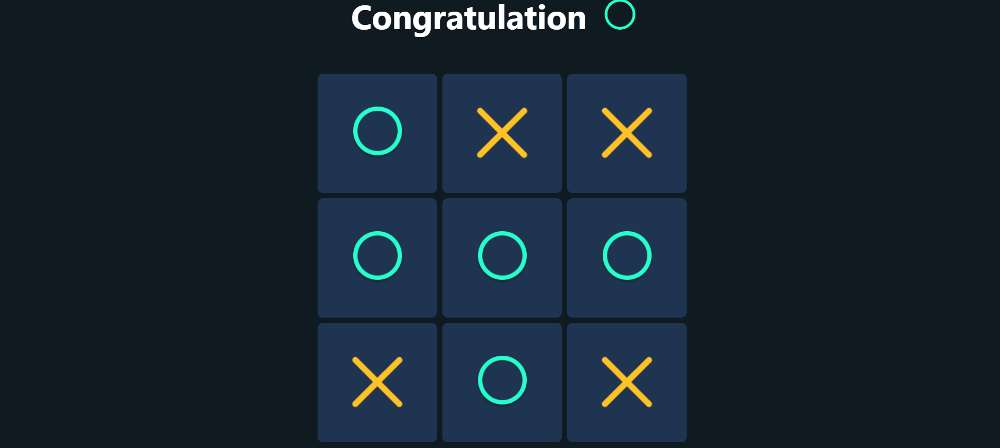

# Tic Tac Toe Game – React JS

An interactive, browser-based Tic Tac Toe game built with **React JS**. Two players take turns placing their marks (⭕ and ❌) on a 3×3 grid, competing to be the first to align three marks in a row, column, or diagonal.



---

## Features

- **Two-player gameplay** – Player 1 places ⭕ (circle) and Player 2 places ❌ (cross), alternating every turn.
- **Win detection** – Automatically checks all 8 possible winning combinations (3 rows, 3 columns, 2 diagonals) after every move.
- **Draw condition** – All 9 squares filled with no winner results in the game ending.
- **Dynamic title** – The game title updates to display the winner when the game ends.
- **Reset / New Game** – A Reset button clears the board and restarts the game at any time.
- **Move locking** – Once a winner is declared, the board is locked to prevent further moves until reset.

---

## Tech Stack

| Technology | Purpose |
|---|---|
| **React JS** (v18) | UI framework and component rendering |
| **JavaScript (ES6+)** | Game logic (win detection, turn management) |
| **CSS3** | Styling and layout |
| **React Hooks** (`useState`, `useRef`) | State management and DOM references |

---

## Getting Started

### Prerequisites

- [Node.js](https://nodejs.org/) v14 or higher
- npm (bundled with Node.js) or [Yarn](https://yarnpkg.com/)

### Installation

1. **Clone the repository**
   ```bash
   git clone https://github.com/Mahima-Sanketh-Git/Tic-Toc-Toe-Game-React-JS.git
   cd Tic-Toc-Toe-Game-React-JS
   ```

2. **Install dependencies**
   ```bash
   npm install
   ```

3. **Start the development server**
   ```bash
   npm start
   ```

4. Open [http://localhost:3000](http://localhost:3000) in your browser to play the game.

### Available Scripts

| Command | Description |
|---|---|
| `npm start` | Runs the app in development mode |
| `npm test` | Launches the test runner in interactive watch mode |
| `npm run build` | Builds the app for production into the `build/` folder |

---

## How to Play

1. The game starts with **Player 1** (⭕ circle).
2. Click any empty square on the 3×3 grid to place your mark.
3. Players alternate turns automatically.
4. The first player to get **3 marks in a row** (horizontally, vertically, or diagonally) **wins**.
5. If all 9 squares are filled and no player has won, the game ends in a **draw**.
6. Click the **Reset** button at any time to start a new game.

---

## Project Structure

```
Tic-Toc-Toe-Game-React-JS/
├── public/
│   └── index.html          # HTML entry point
├── src/
│   ├── components/
│   │   ├── TicTacToe/
│   │   │   ├── TicTacToe.jsx   # Main game component (board, logic, state)
│   │   │   └── TicTacToe.css   # Game-specific styles
│   │   └── assets/
│   │       ├── circle.png      # Circle (⭕) icon
│   │       └── cross.png       # Cross (❌) icon
│   ├── App.js              # Root component
│   ├── App.css             # Global app styles
│   └── index.js            # React DOM entry point
├── package.json
└── README.md
```

---

## Contributing

Contributions are welcome! To contribute:

1. Fork the repository.
2. Create a new branch:
   ```bash
   git checkout -b feature/your-feature-name
   ```
3. Make your changes and commit them:
   ```bash
   git commit -m "Add your descriptive commit message"
   ```
4. Push to your fork:
   ```bash
   git push origin feature/your-feature-name
   ```
5. Open a **Pull Request** against the `main` branch.

Please ensure your code follows the existing style and that the app runs without errors before submitting.

---

## License

This project is open source and available under the [MIT License](https://opensource.org/licenses/MIT).
